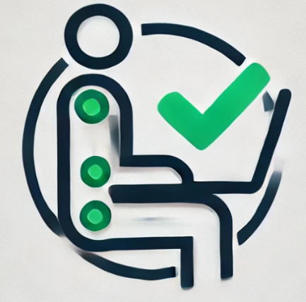

# Be Straight!

## Overview

This project is a web application that uses a laptop’s camera to monitor the user's posture and notify them when their posture is incorrect based on the head position with respect to the camera. The app is lightweight and runs entirely on the client side, ensuring privacy and efficiency.

## Features

- **Posture Detection:** Uses the webcam to detect the user's head position and determines if their posture is incorrect.
- **Customizable Time Intervals:** Users can configure how frequently the posture should be checked (always or at specific intervals).
- **Notifications:** Plays a sound alert when an improper posture is detected (toggleable).
- **Responsive Modal:** Provides additional information about the project and links to the author's profiles in a semi-transparent modal.
- **Play/Pause Functionality:** Allows users to start or pause posture detection.
- **Camera Usage Timeout:** Disables the camera during idle periods to save resources.

## Technologies Used

- **HTML5** for structure
- **CSS3** for styling, with responsiveness for various screen sizes
- **Vanilla JavaScript** for interactivity and posture detection logic
- **Remix Icon Library** for UI icons
- **Google MediaPipe** for posture detection

## Getting Started

### Prerequisites

- A modern web browser (Google Chrome, Mozilla Firefox, etc.)
- A laptop or desktop computer with a webcam

### Access via GitHub Pages

The application is accessible online through GitHub Pages. Simply visit:  
[Posture Reminder Web Application](https://naza-official.github.io/be-straight/)

## Usage

1. Open the application in your web browser.
2. Click the **Play** button to start posture monitoring.
3. Adjust the settings using the **Hourglass** button to set a time interval for posture checks.
4. Toggle sound or browser notifications with the **Bell** button.
5. Click the **Info** button for additional details about the project and the author.
6. Pause the monitoring at any time by clicking the **Pause** button.

## Notifications

- When the application is accessed online through a browser, sound notifications are played using the browser's notifications API.

- If the application is run locally by opening the index.html file, sound playback will be limited to the browser tab and may depend on the browser's local file security settings.

## Future Improvements

- Add support for advanced posture detection using machine learning models.
- Add user customization for alert messages and sound notifications.
- Support mobile devices with front-facing cameras.

## Author

**Nazarii Nikitchyn**  
Data & Software Engineer

- [GitHub](https://github.com/naza-official)
- [LinkedIn](https://www.linkedin.com/in/nazarii-nikitchyn-037880257/)

## License

This project is licensed under the [MIT License](LICENSE).

---

Feel free to contribute or suggest improvements!
